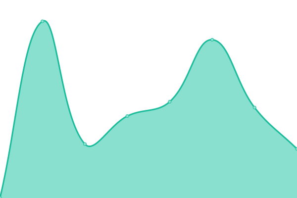
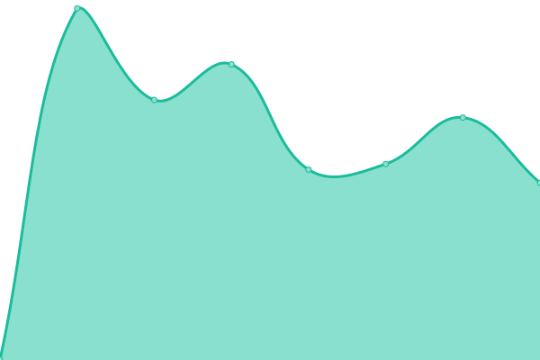
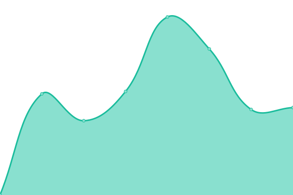
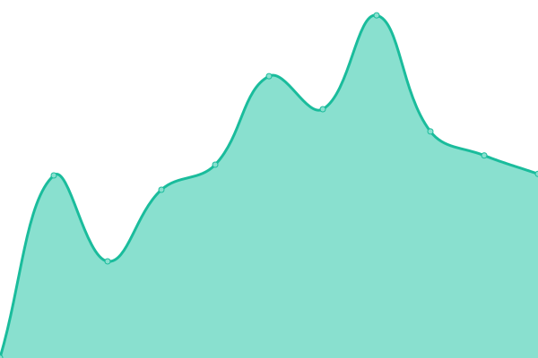
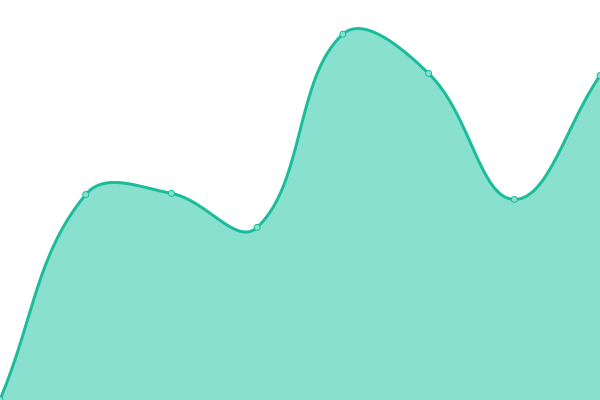

# [📈 Live Status](https://keywordnew.github.io/helsinki-watchtower): <!--live status--> **🟧 Partial outage**

This repository contains the open-source uptime monitor and status page for [Manil Chowdhury](https://manil.xyz), powered by [Upptime](https://github.com/upptime/upptime).

With [Upptime](https://upptime.js.org), you can get your own unlimited and free uptime monitor and status page, powered entirely by a GitHub repository. We use [Issues](https://github.com/keywordnew/helsinki-watchtower/issues) as incident reports, [Actions](https://github.com/keywordnew/helsinki-watchtower/actions) as uptime monitors, and [Pages](https://keywordnew.github.io/helsinki-watchtower) for the status page.

<!--start: status pages-->
<!-- This summary is generated by Upptime (https://github.com/upptime/upptime) -->
<!-- Do not edit this manually, your changes will be overwritten -->
<!-- prettier-ignore -->
| URL | Status | History | Response Time | Uptime |
| --- | ------ | ------- | ------------- | ------ |
|  [Helsinki Region Environmental Services HSY](https://www.hsy.fi/en/water-and-sewers/water-supply-cuts-and-disturbances-in-water-supply/) | 🟩 Up | [helsinki-region-environmental-services-hsy.yml](https://github.com/keywordnew/helsinki-watchtower/commits/HEAD/history/helsinki-region-environmental-services-hsy.yml) | 

 1106ms
     
 | 

<a href="https://keywordnew.github.io/helsinki-watchtower/history/helsinki-region-environmental-services-hsy">100.00%</a>
    

|  [Helen Oy](https://www.helen.fi/en) | 🟩 Up | [helen-oy.yml](https://github.com/keywordnew/helsinki-watchtower/commits/HEAD/history/helen-oy.yml) | 

 686ms
     
 | 

<a href="https://keywordnew.github.io/helsinki-watchtower/history/helen-oy">100.00%</a>
    

|  [Elisa Oyj](https://verkkoasiointi.elisa.fi/) | 🟩 Up | [elisa-oyj.yml](https://github.com/keywordnew/helsinki-watchtower/commits/HEAD/history/elisa-oyj.yml) | 

 581ms
     
 | 

<a href="https://keywordnew.github.io/helsinki-watchtower/history/elisa-oyj">100.00%</a>
    

|  [Helsingin ja Uudenmaan sairaanhoitopiiri](https://www.hus.fi/potilaalle/sairaalat-ja-toimipisteet/paivystysapu-116117) | 🟩 Up | [helsingin-ja-uudenmaan-sairaanhoitopiiri.yml](https://github.com/keywordnew/helsinki-watchtower/commits/HEAD/history/helsingin-ja-uudenmaan-sairaanhoitopiiri.yml) | 

 697ms
     
 | 

<a href="https://keywordnew.github.io/helsinki-watchtower/history/helsingin-ja-uudenmaan-sairaanhoitopiiri">99.33%</a>
    

|  [Helsinki Police Department](https://poliisi.fi/tee-rikosilmoitus) | 🟩 Up | [helsinki-police-department.yml](https://github.com/keywordnew/helsinki-watchtower/commits/HEAD/history/helsinki-police-department.yml) | 

 1002ms
     
 | 

<a href="https://keywordnew.github.io/helsinki-watchtower/history/helsinki-police-department">100.00%</a>
    

|  [Helsinki Regional Transport Authority](https://www.hsl.fi/) | 🟥 Down | [helsinki-regional-transport-authority.yml](https://github.com/keywordnew/helsinki-watchtower/commits/HEAD/history/helsinki-regional-transport-authority.yml) | 

 500ms
     
 | 

<a href="https://keywordnew.github.io/helsinki-watchtower/history/helsinki-regional-transport-authority">0.00%</a>
    

|  [OP Financial Group](https://www.op.fi/home-page) | 🟩 Up | [op-financial-group.yml](https://github.com/keywordnew/helsinki-watchtower/commits/HEAD/history/op-financial-group.yml) | 

 1955ms
     
 | 

<a href="https://keywordnew.github.io/helsinki-watchtower/history/op-financial-group">100.00%</a>
    

<!--end: status pages-->

[**Visit our status website →**](https://keywordnew.github.io/helsinki-watchtower)

## 📄 License

- Powered by: [Upptime](https://github.com/upptime/upptime)
- Code: [MIT](./LICENSE) © [Manil Chowdhury](https://manil.xyz)
- Data in the `./history` directory: [Open Database License](https://opendatacommons.org/licenses/odbl/1-0/)
